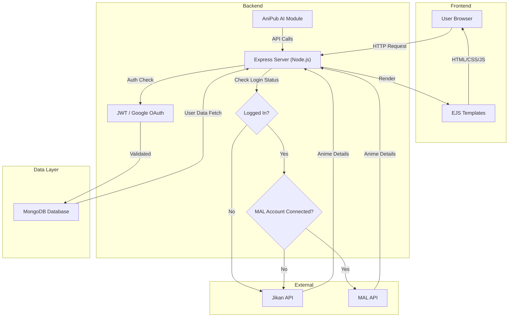
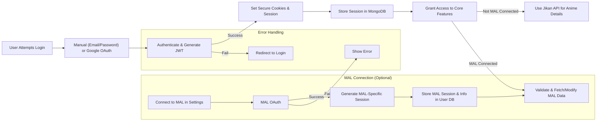
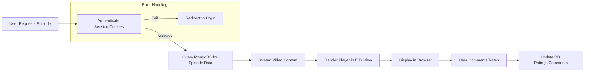
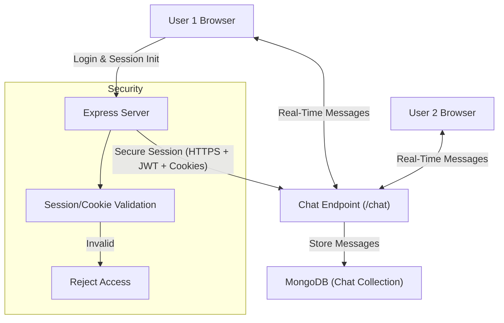
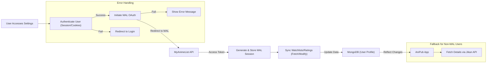
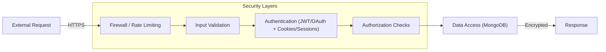

# AniPub: The Ultimate Anime Multiverse  

<p align="center">
  &nbsp;&nbsp;
</p>

[](https://github.com/AnimePub/AniPub/stargazers)
[](https://github.com/AnimePub/AniPub/network/members)
[](https://github.com/AnimePub/AniPub/watchers)
[](https://github.com/AnimePub/AniPub/blob/main/LICENSE)
[](https://anipub.xyz)


Welcome to **AniPub**, the modern, ad-free, and privacy-first anime streaming platform built for true otakus. Dive into a vast multiverse of anime without distractions, trackers, or interruptions. Powered by a passionate community, AniPub combines blazing-fast performance, intuitive design, and innovative features like AI assistance to redefine how you watch, discover, and connect over anime.

Whether you're binge-watching classics like *One Piece* or exploring hidden gems, AniPub is your gateway to an endless anime adventure. Open-source, extensible, and community-driven—join us in shaping the future of anime streaming!

```
Currenlty we aren't able to block Ads by 100% .. it should be arround 97~100 % ..
Working on Providing complete Ad Free Service to you all 

```
## Table of Contents
- [Features](#features)
- [Why AniPub?](#why-anipub)
- [Tech Stack](#tech-stack)
- [Architecture Overview](#architecture-overview)
- [Installation](#installation)
- [Usage](#usage)
- [API Documentation](#api-documentation)
- [Contributing](#contributing)
- [Roadmap](#roadmap)
- [Community & Support](#community--support)
- [Security & Privacy](#security--privacy)
- [License](#license)

## Features
AniPub is packed with features designed to enhance your anime experience:

- **Ad-Free Streaming**: Enjoy uninterrupted viewing—no pop-ups, banners, or sponsored content.
- **Privacy-Focused**: No user tracking, data mining, or third-party analytics. Your watch history stays yours.
- **Blazing-Fast Performance**: Optimized for speed with cloud hosting, responsive design, and efficient data loading.
- **AniPub AI · Zero Two**: Your personal AI companion for recommendations, trivia, and chat-based interactions. Ask about plot summaries, character details, or even fan theories!
- **Save & Bookmark**: Create watchlists, save episodes, and pick up right where you left off.
- **Playlists**: Curate custom playlists and Track your anime.
- **Community Comments**: Discuss episodes, theories, and fan art in real-time threaded comments.
- **Ratings System**: Rate anime and see community averages to discover top-rated shows.
- **Download Support** (Coming Soon): Offline viewing for your favorite episodes.
- **Multi-Device Sync**: Seamless experience across desktop, mobile, and tablets.
- **Search & Discovery**: Advanced search with by Genres or Names upto 8k+ Anime .
- **Secure Chat (/chat)**: Real-time communication between users with secure sessions to discuss anime, share recommendations, or connect with fellow otakus.
- **MyAnimeList (MAL) Integration**: Connect your MyAnimeList account in settings to sync watchlists, ratings, and progress seamlessly. Uses secure sessions and stores connection info in the user database for validation and data modification. Even if not connected, AniPub uses the Jikan API (unofficial MAL API) to fetch and display detailed anime information on the /details/animename page.

## Why AniPub?
In a world flooded with ad-riddled streaming sites, AniPub stands out as a beacon for anime lovers. Born from frustration with bloated platforms, it's crafted with:
- **Community at Heart**: Open-source contributions drive innovation.
- **Simplicity & Elegance**: Clean UI inspired by modern web design principles.
- **Accessibility**: Free forever, with no paywalls or subscriptions.
- **Innovation**: Integrating AI for smarter, more engaging interactions.

If you're tired of endless ads and privacy invasions, AniPub is your escape pod to pure anime bliss.

## Tech Stack
AniPub leverages a robust, modern stack for reliability and scalability:

| Layer       | Technologies                  | Purpose                          |
|-------------|-------------------------------|----------------------------------|
| **Frontend** | EJS, CSS, JavaScript         | Server-rendered templates for dynamic UI, custom styling, and interactive elements. |
| **Backend**  | Node.js, Express             | Handles API requests, routing, and server logic. |
| **Database** | MongoDB                      | Stores user data, anime metadata, ratings, comments, and playlists. |
| **Auth**     | JWT, Google OAuth            | Secure authentication and session management. |
| **Security** | Hashed Passwords, HTTPS      | Protects user data and ensures secure connections. |
| **Assets**   | Custom Images & Thumbnails   | Enhances visual appeal with anime-specific media. |
| **External APIs** | Jikan (MAL Unofficial)      | Fetches detailed anime info for /details pages, even without user MAL connection. |

## Architecture Overview
AniPub follows a full-stack MVC (Model-View-Controller) architecture, ensuring separation of concerns for maintainability. Here's how it all ties together:

### High-Level System Model
The application flows from user requests through the backend to the database, rendering views dynamically.



- **User Browser**: Interacts with the UI, sending requests for streaming, searches, or comments.
- **Express Server**: Acts as the controller, processing requests and orchestrating responses.
- **Auth Layer**: Validates users via JWT tokens or OAuth, preventing unauthorized access.
- **MongoDB**: Models data like anime entries (e.g., title, episodes, ratings) and user profiles.
- **EJS Templates**: Views that dynamically generate HTML based on data from the backend.
- **AniPub AI**: An integrated module for conversational features.
- **Jikan API**: Used to fetch anime details for /details pages, regardless of user MAL connection.

### Authentication & Session Model
Users can log in manually (email/password) or via Google OAuth. Upon successful login, they receive secure cookies and sessions. If the user connects to MyAnimeList (MAL), an additional MAL-specific session is generated and stored in the database. This session validates the user for fetching, requesting, or modifying data via the MyAnimeList API. If not connected to MAL, no additional session is created, but anime details are still fetched via Jikan API for display purposes.



- **Secure Cookies & Sessions**: Managed via JWT for general authentication, enabling features like chat and multi-device sync.
- **MAL-Specific Session**: Only for MAL-connected users; allows personalized data sync with MyAnimeList API.
- **Jikan Fallback**: For all users, provides anime details on /details/animename pages without requiring personal MAL connection.

### Data Flow Model
For a typical user action, like watching an episode:



This model ensures efficient, secure data handling with real-time updates.

### Secure Chat Model (/chat)
AniPub uses secure sessions for real-time user communication via the /chat endpoint. Here's the flow:



- **Secure Sessions & Cookies**: Ensures encrypted, authenticated communication between users.
- **Real-Time**: Enables live discussions on anime topics.

### MyAnimeList (MAL) Integration Model
Connect your MAL account in settings for seamless syncing:



- **OAuth Flow**: Secure connection to MAL for importing/exporting data, with MAL-specific session if connected.
- **Sync**: Automatically updates watch progress, ratings, and lists. MAL info is stored in the user database for ongoing validation.
- **Jikan API**: Used for /details/animename to show anime details for all users, even without personal MAL connection.

### Security Model
AniPub prioritizes security through layered protections:



Passwords are hashed (e.g., using bcrypt), sessions and cookies are secure, and all communications are encrypted.

## Installation
Get AniPub running locally in minutes!

### Prerequisites
- Node.js (v14+)
- MongoDB (local or cloud instance)
- Git

### Steps
1. Clone the repository:
   ```bash
   git clone https://github.com/AnimePub/AniPub.git
   cd AniPub
   ```
2. Install dependencies:
   ```bash
   npm install
   ```
3. Set up environment variables (copy `.env.example` to `.env` and fill in details like MongoDB URI).
4. Start the server:
   ```bash
   node backend/app.js
   ```
5. Open your browser: http://localhost:3000

For quick setups:
- **Linux**: Run `curl -sL https://github.com/AnimePub/install-scripts/raw/main/install.sh | bash` (review script first!).
- **Arch Linux**: Use the dedicated `arch.sh` script.

**Note**: For testing, use default credentials (email: aabdullahal466@gmail.com, password: 12345678). In production, secure your setup!

## Usage
- **Login Options**: Manual login with email/password or Google OAuth. Upon login, secure cookies and sessions are set for authentication.
- **Browsing Anime**: Search or browse the catalog on the homepage.
- **Streaming**: Click an episode to start watching—seamless and buffer-free.
- **AI Chat**: Interact with Zero Two for personalized recommendations.
- **Community Features**: Log in to comment, rate, and create playlists.
- **Secure Chat**: Access /chat after login to communicate with other users using secure sessions.
- **MAL Connect**: Go to settings, connect your MyAnimeList account via OAuth. If connected, a MAL-specific session is created to enable data fetch/request/modify with MyAnimeList API. Connection info is saved in the database.
- **Anime Details (/details/animename)**: Displays full anime info using Jikan API, available to all users regardless of MAL connection.


Example API Endpoint (for developers): `/api/anime/search?q=onepiece` – Returns JSON results.

## API Documentation
AniPub provides public API endpoints for accessing anime data. Base URLs: `https://api.anipub.xyz` or `https://www.anipub.xyz`. No authentication required—all endpoints are open.

| Endpoint | Method | Description | Parameters | Response (JSON Example) |
|----------|--------|-------------|------------|-------------------------|
| **/api/info/:id** | GET | Get basic anime metadata (name, image, genres, etc.). | `id` (integer ≥1) | `{ "_id": 1, "Name": "Example Anime", "ImagePath": "/path/to/image", ... }` |
| **/api/getAll** | GET | Get total number of anime entries. | None | Integer (e.g., 1030) |
| **/v1/api/details/:id** | GET | Get streaming links for anime episodes. | `id` (integer) | `{ "local": { "name": "Anime", "link": "src=URL", "ep": [{ "link": "src=URL" }, ...] } }` |
| **/anime/api/details/:id** | GET | Get full details including MAL (Jikan) data and characters. | `id` (integer) | `{ "local": {...}, "jikan": {...}, "characters": [{ "character": {...}, "role": "Main", "voice_actors": [] }, ...] }` |
| **/api/check** | POST | Check if anime name and genre exist. | Body: `{ "Name": "string", "Genre": "string or array" }` | `{ "nameMatch": true, "genreMatch": true, ... }` |

- **Image URLs**: Prepend `https://anipub.xyz/` if paths are relative.
- **Error Codes**: 200 OK, 400 Bad Request, 404 Not Found, 500 Server Error.
- **Rate Limiting**: May apply for heavy use.
- **MAL Integration**: Uses Jikan API for MAL data in `/anime/api/details/:id` and frontend /details/animename pages, even without user-specific MAL connection.

For more details, visit [api.anipub.xyz](https://api.anipub.xyz).

## Contributing
We love contributions! Whether it's bug fixes, new features, or UI tweaks:
- Check `CONTRIBUTING.md` for guidelines.
- Fork the repo, create a branch, and submit a Pull Request.
- Report issues or suggest ideas in Discussions.

All contributions must adhere to our Code of Conduct (`CODE_OF_CONDUCT.md`).

## Roadmap
- **Short-Term**: Enhanced search filters, mobile app integration.
- **Medium-Term**: Full download support, recommendation engine using ML.
- **Long-Term**: Expanded AI capabilities, multi-language support, VR streaming.

Track progress in Issues and Discussions.

## Community & Support
- **Discussions**: Share ideas, ask questions, or join announcements.
- **Discord**: Join our server for real-time chats (link above).
- **Star & Share**: Help us grow by starring the repo and spreading the word!

For security issues, see `SECURITY.md`.

## Security & Privacy
AniPub is built with security in mind:
- **No Tracking**: Zero cookies for analytics (only secure auth cookies).
- **Data Protection**: All user data is encrypted and minimal.
- **Open Audits**: As open-source, anyone can review the code.

We comply with GPL-3.0 and encourage responsible use.

## License
AniPub is licensed under the [GNU General Public License v3.0](LICENSE). Feel free to use, modify, and distribute—just keep it open-source!

## Star History

[](https://www.star-history.com/?repos=AnimePub%2FAniPub&type=date&logscale=&legend=top-left)
